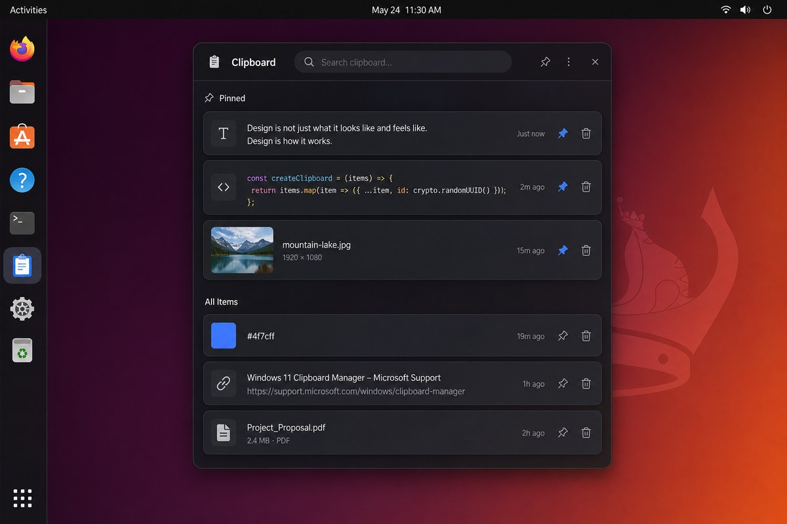

# 📋 Ubuntu Clipboard — تاریخچه کلیپ‌بورد شبیه ویندوز ۱۱

> **Win+V** روی اوبونتو: پنجره شناور، جستجوی فوری، سنجاق کردن و Paste خودکار.


<p align="center">
  
  <br/>
  <em>طراحی الهام‌گرفته از Windows 11 — پنجره بدون قاب، گوشه‌های گرد و شفافیت</em>
</p>

---

## ✨ این برنامه چه می‌کند؟

یک سرویس **مقیم (resident)** در پس‌زمینه اجرا می‌شود، هر چیزی که کپی می‌کنید را در یک
دیتابیس SQLite ذخیره می‌کند و با زدن **Win+V** پنجره‌ای شبیه کلیپ‌بورد ویندوز ۱۱ باز
می‌شود:

- تاریخچه متن، لینک، کد، رنگ، تصویر و فایل
- **جستجوی زنده** روی متن کامل آیتم‌ها
- **سنجاق (Pin)** برای آیتم‌های همیشه‌در‌دسترس
- **کلیک = Paste**: آیتم روی کلیپ‌بورد می‌رود و `Ctrl+V` خودکار در برنامه قبلی زده می‌شود
- فیلتر خودکار رمزها و شماره کارت بانکی (الگوهای قابل تنظیم)
- ناوبری کامل با کیبورد، تم تاریک/روشن/سیستمی، فارسی و انگلیسی

---

## 🎯 مقایسه با کلیپ‌بورد ویندوز

| قابلیت ویندوز ۱۱ | وضعیت | توضیح |
|---|---|---|
| `Win+V` برای باز کردن | ✅ | میانبر GNOME، قابل تغییر در تنظیمات |
| تاریخچه متنی | ✅ | پیش‌فرض ۸۰ آیتم، قابل تنظیم تا ۱۰۰۰ |
| تصاویر | ✅ | ذخیره به‌صورت PNG با بندانگشتی |
| سنجاق کردن | ✅ | پیش‌فرض ۲۰ آیتم، جدا از آیتم‌های اخیر |
| جستجو | ✅ | فیلتر زنده، جستجو در محتوای کامل |
| حذف تکی / پاک کردن همه | ✅ | با نگه‌داشتن آیتم‌های سنجاق‌شده |
| Paste با یک کلیک | ✅ | Copy + شبیه‌سازی `Ctrl+V` |
| تشخیص نوع محتوا | ✅ | متن، کد، لینک، رنگ، تصویر، فایل |
| عدم ضبط رمز عبور | ✅ | Regex + علامت `x-kde-passwordManagerHint` |
| اجرای خودکار پس از ورود | ✅ | فایل autostart در `~/.config/autostart` |

---

## 🚀 نصب

### پیش‌نیازها

| مورد | حداقل |
|---|---|
| اوبونتو | ۲۲.۰۴ (GNOME 42) |
| Python | ۳.۱۰ |
| GTK | ۴.۶ — `gir1.2-gtk-4.0` |
| libadwaita | ۱.۰ — `gir1.2-adw-1` (اختیاری، برای ظاهر GNOME) |
| کلیپ‌بورد | `wl-clipboard` (Wayland) یا `xclip` (X11) |
| Paste خودکار | `wtype` / `ydotool` (Wayland) یا `xdotool` (X11) |

> در صورت نبود libadwaita برنامه کار می‌کند؛ فقط پنجره ظاهر Adwaita ندارد.
> در صورت نبود ابزار Paste، آیتم کپی می‌شود و پیام «کپی شد» نمایش داده می‌شود.

### روش ۱ — اسکریپت نصب (پیشنهادی)

```bash
git clone https://github.com/ahmad75naraghi/ubuntu-clipboard.git
cd ubuntu-clipboard
./scripts/install.sh
```

اسکریپت به‌ترتیب این کارها را انجام می‌دهد:

1. بسته‌های سیستمی لازم را بررسی و (با تأیید شما) با `apt-get` نصب می‌کند
2. یک محیط مجازی **با دسترسی به بسته‌های سیستمی** در
   `~/.local/share/ubuntu-clipboard/venv` می‌سازد (لازم برای PEP 668 در اوبونتو ۲۳.۰۴+)
3. پکیج را در آن نصب می‌کند و دو اجراپذیر در `~/.local/bin` می‌گذارد
4. با `ubuntu-clipboard --install` میان‌بر دسکتاپ، آیکون، autostart و میانبر Win+V را می‌سازد
5. سرویس را در پس‌زمینه اجرا می‌کند و با `--status` موفقیت را بررسی می‌کند

گزینه‌ها: `-y/--yes` (بدون پرسش)، `--no-apt` (نصب نکردن بسته‌های سیستمی)،
`--no-start` (اجرا نکردن سرویس در پایان)، `-h/--help`.

### روش ۲ — نصب دستی

```bash
sudo apt update
sudo apt install python3-gi python3-gi-cairo gir1.2-gtk-4.0 gir1.2-adw-1 \
                 wl-clipboard xclip wtype xdotool

python3 -m venv --system-site-packages ~/.local/share/ubuntu-clipboard/venv
~/.local/share/ubuntu-clipboard/venv/bin/pip install .
~/.local/share/ubuntu-clipboard/venv/bin/ubuntu-clipboard --install   # میان‌برها و autostart
~/.local/share/ubuntu-clipboard/venv/bin/ubuntu-clipboard --background # اجرای سرویس
```

### روش ۳ — از مخزن، بدون نصب

```bash
python3 -m ubuntu_clipboard --install      # یک‌بار: میان‌بر دسکتاپ، آیکون، autostart، Win+V
python3 -m ubuntu_clipboard --background   # اجرای سرویس
python3 -m ubuntu_clipboard --toggle       # باز/بسته کردن پنجره
```

> اگر `~/.local/bin` در `PATH` نیست: `export PATH="$HOME/.local/bin:$PATH"` را به
> `~/.profile` اضافه کنید.

---

## 🎮 استفاده

1. هر جایی `Ctrl+C` بزنید — آیتم ذخیره می‌شود.
2. **Win+V** را بزنید تا پنجره باز شود.
3. تایپ کنید تا جستجو شود، یا با `↑`/`↓` حرکت کنید.
4. `Enter` یا کلیک = Paste در همان برنامه‌ای که بودید.

### میان‌برهای داخل پنجره

| کلید | عمل |
|---|---|
| `Esc` | بستن پنجره |
| `↑` `↓` / `Tab` `Shift+Tab` | حرکت بین آیتم‌ها |
| `Enter` | Paste آیتم انتخاب‌شده |
| `Ctrl+1` … `Ctrl+9` | Paste سریع آیتم‌های ۱ تا ۹ |
| `Del` | حذف آیتم |
| `Ctrl+P` | سنجاق / برداشتن سنجاق |
| `Ctrl+,` | باز کردن تنظیمات |
| `Ctrl+Q` | خروج کامل |

با برداشتن فوکوس، پنجره به‌طور خودکار بسته می‌شود
(قابل خاموش‌کردن با `close_on_focus_loss`).

---

## ⌨️ خط فرمان

هر فرمانی که به پنجره نیاز ندارد، بدون GTK و حتی روی SSH کار می‌کند.

```
ubuntu-clipboard [options]
```

| فرمان | کار |
|---|---|
| `--toggle` | باز/بسته کردن پنجره (پیش‌فرض) |
| `--show` / `--hide` | نمایش / پنهان کردن پنجره |
| `--settings` | پنجره تنظیمات |
| `--quit` | خروج از نمونه در حال اجرا |
| `--background` | اجرای سرویس بدون پنجره (همان `--daemon` قدیمی) |
| `--list [N]` | چاپ N آیتم آخر (پیش‌فرض ۲۰) |
| `--clear` | پاک کردن تاریخچه (سنجاق‌ها می‌مانند) |
| `--all` | همراه `--clear`: سنجاق‌ها هم پاک شوند |
| `--install` | ساخت میان‌بر، آیکون، autostart و Win+V |
| `--uninstall` | حذف یکپارچگی دسکتاپ (تاریخچه می‌ماند) |
| `--purge` | همراه `--uninstall`: حذف دیتابیس و تنظیمات |
| `--install-shortcut` / `--remove-shortcut` | فقط میانبر Win+V |
| `--take-binding` | همراه `--install` یا `--install-shortcut`: میانبرهای دیگری که
همان کلید را گرفته‌اند هم حذف شوند |
| `--binding KEYS` | همراه `--install` یا `--install-shortcut`: استفاده از کلید دیگر و
ذخیرهٔ آن در تنظیمات |
| `--diagnose` | بررسی گام‌به‌گام اینکه چرا Win+V پنجره را باز نمی‌کند |
| `--status` | وضعیت کامل محیط، دیتابیس، میان‌بر و سرویس |
| `--logs [N]` | چاپ N خط آخر لاگ (پیش‌فرض ۲۰۰) |
| `--clear-logs` | پاک کردن فایل‌های لاگ |
| `--collect-logs` | ساخت گزارش عیب‌یابی و چاپ مسیر آن |
| `--debug` | لاگ کامل روی stderr |
| `--version` | نمایش نسخه |

```console
$ ubuntu-clipboard --status
Ubuntu Clipboard 2.0.5
  python           3.11.2 (/usr/bin/python3)
  session          wayland
  database         /home/user/.local/share/ubuntu-clipboard/history.db
  items            42 (pinned: 3, images: 5)
  database size    312.4 KiB
  configuration    /home/user/.config/ubuntu-clipboard/config.json
  theme / language system / fa
  desktop entry    /home/user/.local/share/applications/io.github.ahmad75naraghi.UbuntuClipboard.desktop (ok)
  icon             installed
  autostart        enabled
  instance         running
  auto paste       yes via xdotool
  tools            wl-copy=yes, wl-paste=yes, xclip=yes, xsel=no, xdotool=yes, wtype=no, ydotool=no
  clipboard tools  readable / writable
  shortcut         '<Super>v' -> '/usr/bin/python3 -m ubuntu_clipboard --toggle'
```

---

## ⚙️ تنظیمات

تنظیمات از پنجره **⚙️** یا با ویرایش
`~/.config/ubuntu-clipboard/config.json` قابل تغییر است. مقدارهای نامعتبر
به‌جای خطا، اصلاح و در لاگ ثبت می‌شوند.

| کلید | پیش‌فرض | بازه | توضیح |
|---|---|---|---|
| `max_items` | `80` | ۱۰–۱۰۰۰ | تعداد آیتم‌های اخیر |
| `max_item_size_kb` | `512` | ۱–۱۰۲۴۰ | حداکثر اندازه متن |
| `max_image_size_kb` | `8192` | ۶۴–۶۵۵۳۶ | حداکثر اندازه تصویر |
| `pin_limit` | `20` | ۱–۲۰۰ | حداکثر آیتم‌های سنجاق |
| `keep_pinned_on_clear` | `true` | — | نگه‌داشتن سنجاق‌ها هنگام «پاک کردن همه» |
| `exclude_sensitive` | `true` | — | فیلتر رمزها و شماره کارت بانکی |
| `ignore_regex` | الگوهای پیش‌فرض | — | الگوهای نادیده‌گرفتن (Regex پایتون) |
| `theme` | `system` | — | `system` / `dark` / `light` |
| `language` | `fa` | — | `fa` / `en` / `auto` |
| `window_width` / `window_height` | `420` / `560` | ۳۲۰–۱۶۰۰ | اندازه پنجره |
| `image_thumb_height` | `96` | ۴۰–۳۲۰ | ارتفاع بندانگشتی تصویر |
| `close_on_focus_loss` | `true` | — | بستن پنجره با از‌دست‌رفتن فوکوس |
| `auto_start` | `true` | — | اجرا در شروع نشست |
| `shortcut` | `<Super>v` | — | میانبر پیشنهادی هنگام `--install` |

---

## 📁 مسیرها

| چه چیزی | کجا |
|---|---|
| تاریخچه | `${XDG_DATA_HOME:-~/.local/share}/ubuntu-clipboard/history.db` |
| تنظیمات | `${XDG_CONFIG_HOME:-~/.config}/ubuntu-clipboard/config.json` |
| لاگ (چرخشی، ۳ فایل ۵۱۲KB) | `${XDG_CACHE_HOME:-~/.cache}/ubuntu-clipboard/ubuntu-clipboard.log` |
| گزارش عیب‌یابی | `${XDG_CACHE_HOME:-~/.cache}/ubuntu-clipboard/diagnostics.txt` |
| میان‌بر دسکتاپ | `~/.local/share/applications/io.github.ahmad75naraghi.UbuntuClipboard.desktop` |
| autostart | `~/.config/autostart/io.github.ahmad75naraghi.UbuntuClipboard.desktop` |
| آیکون | `~/.local/share/icons/hicolor/512x512/apps/ubuntu-clipboard.png` |

---

## 🏗️ معماری

```
ubuntu_clipboard/
├── __init__.py      # نسخه، شناسه برنامه، نام آیکون
├── cli.py           # تمام فرمان‌های خط فرمان (بدون نیاز به GTK در مسیرهای headless)
├── app.py           # Gio.Application با HANDLES_COMMAND_LINE → تک‌نمونه + IPC روی D-Bus
├── monitor.py       # مانیتور رویدادمحور کلیپ‌بورد روی Gdk.Clipboard (بدون polling)
├── storage.py       # SQLite (WAL)، مهاجرت schema، dedup، جستجو، pin، آمار
├── models.py        # تشخیص نوع محتوا، hash، پیش‌نمایش، زمان نسبی
├── clipboard.py     # تشخیص نشست و توانمندی‌های محیط (Wayland/X11، ابزارهای متن)
├── paste.py         # شبیه‌سازی Ctrl+V با ydotool/wtype/xdotool
├── shortcut.py      # مدیریت میانبر GNOME با gsettings (بدون sed)
├── install.py       # میان‌بر دسکتاپ، آیکون، autostart، پاک‌سازی نسخه ۱
├── config.py        # تنظیمات JSON + مسیرهای XDG + اعتبارسنجی + فیلتر محتوای حساس
├── i18n.py          # ترجمه فارسی/انگلیسی + تشخیص RTL
├── log.py           # لاگ چرخشی
├── ui/
│   ├── window.py    # پنجره اصلی GTK4 (بدون قاب، کنترل کامل با کیبورد)
│   ├── settings.py  # پنجره تنظیمات (Adw.PreferencesWindow با fallback)
│   ├── dialogs.py   # دیالوگ تأیید (Adw.MessageDialog / Gtk.AlertDialog)
│   └── styles.css   # تم ویندوز ۱۱ فقط با ویژگی‌های پشتیبانی‌شده GTK4
└── assets/hicolor/512x512/apps/ubuntu-clipboard.png   # آیکون برنامه
tests/
├── gtk_double.py    # جایگزین سبک GTK برای تست رابط کاربری بدون نمایشگر
└── test_*.py        # ۳۱۰ تست
scripts/
├── install.sh       # نصب بسته‌های سیستمی + محیط مجازی + یکپارچگی دسکتاپ
├── uninstall.sh     # حذف کامل (با گزینه --purge)
└── check_gtk_api.py # بررسی استاتیک APIهای GTK/GDK/Adw بدون نیاز به نمایشگر
```

**جریان داده**

```
Ctrl+C در هر برنامه
      │  Gdk.Clipboard::changed
      ▼
monitor.ClipboardMonitor ──► storage.add_text/add_image/add_files ──► SQLite (WAL)
      │                                      │
      │                            dedup بر اساس hash + تازه‌سازی زمان
      ▼
Win+V ─► Gio.Application (تک‌نمونه، D-Bus) ─► ui.window.ClipboardWindow
                                                   │
                                     کلیک/Enter ───► clipboard.set_content + Ctrl+V
```

تفاوت‌های کلیدی با نسخه ۱:

| نسخه ۱ (مشکل‌دار) | نسخه ۲ |
|---|---|
| قفل فایل + `SIGKILL` برای تک‌نمونه‌سازی | `Gio.Application` با IPC روی D-Bus |
| پنجره ۳۵۰ms بعد از Copy بسته می‌شد و محتوا از بین می‌رفت | فرآیند مقیم مالک انتخاب (selection) می‌ماند |
| polling چهار بار در ثانیه با `wl-paste` | سیگنال `changed` و خواندن async |
| `sed` روی `gsettings` با یکسان‌سازی `custom1` | پارس و بازنویسی فهرست در پایتون |
| GTK3 + fallback به Tkinter | GTK4 + libadwaita (با fallback استاندارد) |
| نشتی file descriptor و WAL غیرفعال | اتصال thread-local، `PRAGMA journal_mode=WAL` |
| سه فایل لاگ بی‌نهایت | یک لاگ چرخشی |

---

## 🧪 توسعه

```bash
git clone https://github.com/ahmad75naraghi/ubuntu-clipboard.git
cd ubuntu-clipboard

python3 -m venv .venv
.venv/bin/pip install pytest ruff
.venv/bin/pip install --no-deps PyGObject-stubs   # برای بررسی استاتیک GTK

make test        # ۳۱۰ تست
make lint        # ruff check + ruff format --check
make gtk-check   # بررسی استاتیک APIهای GTK/GDK/Adw
make check       # lint + test
make run         # python3 -m ubuntu_clipboard --toggle
```

چون محیط توسعه و CI نمایشگر ندارند، درستی کار با GTK سه لایه تأیید می‌شود:

1. **بررسی استاتیک** (`scripts/check_gtk_api.py`) نام‌های `Gtk.*`/`Gdk.*`/`Adw.*` و
   متدهای هر کلاس را با stubهای PyGObject مقایسه می‌کند؛ مثلاً `Gdk.ToplevelState.ACTIVE`
   (که وجود ندارد) یا یک متد اشتباه پیش از اجرا گرفته می‌شود.
2. **تست‌های UI** (`tests/gtk_double.py`) یک جایگزین سبک برای GTK هستند تا منطق پنجره،
   تنظیمات، مانیتور کلیپ‌بورد و منطق برنامه بدون نمایشگر تست شود (کلیک، کلیدها،
   سنجاق، جستجو، فوکوس، نوتفیکیشن و ...).
3. **تست‌های سرتاسری** (`tests/test_entrypoints.py`) همان `gi` جعلی را روی `PYTHONPATH`
   می‌گذارند و برنامه را در یک **مفسر تازه** با `python -m ubuntu_clipboard` و
   اسکریپت‌های نصب‌شده اجرا می‌کنند؛ بنابراین ترتیب import، پارس آرگومان‌ها، چرخهٔ
   `Gtk.Application` و فایل‌های نوشته‌شده زیر `$XDG_*` هم واقعاً آزموده می‌شوند.

ساختار تست‌ها: هر ماژول یک فایل `tests/test_*.py` با home مجزا (متغیرهای `XDG_*`
موقت) و بدون نیاز به شبکه، نمایشگر یا سرویس خارجی.

---

## 🔧 عیب‌یابی

**Win+V کار نمی‌کند؟**

```bash
ubuntu-clipboard --diagnose             # چک‌لیست کامل: برنامه، میانبر، تداخل‌ها، دیمن
ubuntu-clipboard --install-shortcut     # ثبت مجدد میانبر (و هشدار تداخل‌ها)
ubuntu-clipboard --status               # بررسی خط «shortcut»
gsettings get org.gnome.settings-daemon.plugins.media-keys custom-keybindings
```

`--diagnose` همهٔ پیش‌نیازها را یکی‌یکی بررسی می‌کند: نصب بودن GTK 4، در حال اجرا بودن
سرویس، ثبت بودن میانبر، وجود فایل فرمان، تداخل با میانبرهای دیگر یا میانبر پوستهٔ گنوم،
و زنده بودن `gsd-media-keys`. در پایان فهرست مشکلات و سریع‌ترین راه‌حل‌ها را چاپ می‌کند.

اگر میانبر دیگری هم روی همان کلید باشد، `--install-shortcut` هشدار می‌دهد و مسیر و
فرمان آن را چاپ می‌کند (آن میانبر را دست نمی‌زنیم چون مال شماست)؛ در
**Settings → Keyboard → Custom Shortcuts** آن را حذف یا جابه‌جا کنید، یا صریحاً بگویید
که کلید را بردارد:

```bash
ubuntu-clipboard --take-binding --install-shortcut
```

> اگر میانبر متداخل مربوط به یک **کلیپ‌بورد منیجر دیگر** باشد (مثل `diodon`)، پیام
> هشدار نام آن را هم می‌گوید. آن برنامه‌ها میانبر داخلی ندارند و فقط با یک
> Custom Shortcut روی `<Super>v` می‌نشینند؛ دو کلیپ‌بورد منیجر با هم لازم نیست —
> یکی را بردارید یا کلید دیگری به آن بدهید.

اگر میانبر دیگری روی `<Super>v` باشد، `--install-shortcut` آن را غیرفعال می‌کند و
هشدار می‌دهد. ممکن است لازم باشد یک بار از حساب خارج و دوباره وارد شوید.

اگر `--install-shortcut` ناموفق بود، خودِ پیام خطای `gsettings` چاپ می‌شود؛ در آن صورت
میانبر را دستی بسازید: **Settings → Keyboard → Custom Shortcuts** با فرمان
`ubuntu-clipboard --toggle` و کلید `<Super>v`.

برای بررسی دستی، توجه کنید که فهرست میانبرها در schema مادر و مقدارهای هر میانبر در
schema فرزندِ قابل‌جابه‌جایی ذخیره می‌شوند:

```bash
# فهرست مسیرها (بدون path — schema مادر قابل‌جابه‌جایی نیست)
gsettings get org.gnome.settings-daemon.plugins.media-keys custom-keybindings
# مقدارهای میانبر ما (path لازم است)
gsettings get org.gnome.settings-daemon.plugins.media-keys.custom-keybinding:/org/gnome/settings-daemon/plugins/media-keys/custom-keybindings/ubuntu-clipboard/ binding
```

**پنجره باز می‌شود ولی Paste خودکار انجام نمی‌شود؟**

```bash
sudo apt install wtype      # یا: ydotool (روی Wayland)
sudo apt install xdotool    # روی X11
ubuntu-clipboard --status   # خط auto paste
```

بدون این ابزارها آیتم در کلیپ‌بورد قرار می‌گیرد و کافی است خودتان `Ctrl+V` بزنید.

**برنامه اجرا نمی‌شود؟**

```bash
ubuntu-clipboard --debug        # لاگ کامل روی ترمینال
ubuntu-clipboard --logs 100     # لاگ‌های قبلی
ubuntu-clipboard --collect-logs # ساخت گزارش کامل برای ارسال در Issue
```

**GTK 4 نصب نیست؟**

```bash
sudo apt install python3-gi python3-gi-cairo gir1.2-gtk-4.0 gir1.2-adw-1
```

فرمان‌های `--status`, `--list`, `--clear`, `--logs` بدون GTK هم کار می‌کنند.

**می‌خواهم از داده‌های نسخه ۱ مهاجرت کنم:** لازم نیست کاری کنید؛ در اولین اجرا
`~/.config/ubuntu-clipboard/history.db` به مسیر جدید منتقل و schema آن به‌روز
می‌شود (تصاویر base64 قدیمی به BLOB تبدیل می‌شوند).

---

## 🗑️ حذف

```bash
./scripts/uninstall.sh            # حذف یکپارچگی دسکتاپ (تاریخچه می‌ماند)
./scripts/uninstall.sh --purge    # حذف کامل شامل تاریخچه و تنظیمات
```

---

## 📄 مجوز

MIT — استفاده شخصی و تجاری آزاد است. فایل [LICENSE](LICENSE) را ببینید.

---

## English Summary

**Ubuntu Clipboard** is a Windows 11 style clipboard manager for Ubuntu. A resident
GTK 4 application (single instance over D-Bus, no lock files) keeps a searchable
SQLite history of text, links, code, colours, images and files. Press **Win+V** to
open a frameless floating window; click or hit `Enter` to paste into the previously
focused application. Secrets and bank card numbers are filtered out by default, the
clipboard is monitored through `Gdk.Clipboard` signals instead of polling, and every
module outside `ui/` is importable without a display, which is what the 310 headless
tests exercise.

```bash
git clone https://github.com/ahmad75naraghi/ubuntu-clipboard.git
cd ubuntu-clipboard && ./scripts/install.sh
```
